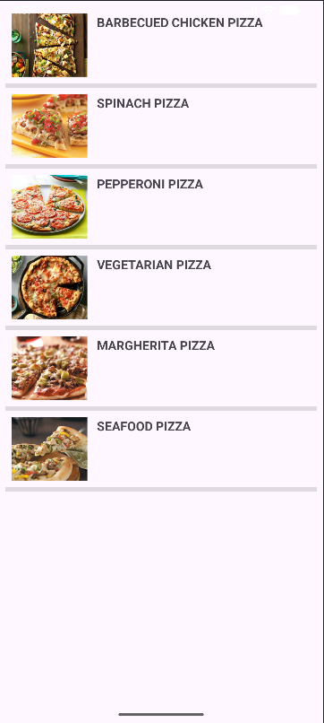
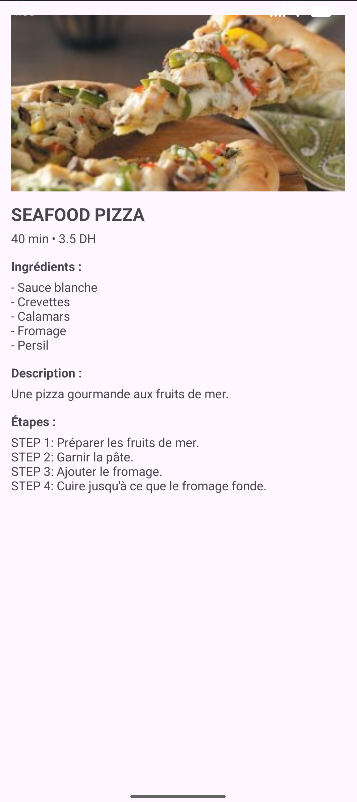

Application Mobile – Gestion de Recettes (Pizza)

Ce projet est une application mobile Android développée en Java.
Elle permet d’afficher une liste de pizzas, consulter leurs détails (ingrédients, description, étapes de préparation) et visualiser les informations principales comme le prix et le temps de préparation.

Description du projet

L’application est composée de plusieurs écrans :

Splash Screen
Un écran d’accueil s’affiche pendant quelques secondes au lancement de l’application.

Liste des pizzas
Affiche toutes les pizzas disponibles sous forme de liste avec :

Lorsqu’on clique sur une pizza, un écran détail s’ouvre avec :

Image

Nom

Temps et prix

Ingrédients

Description

Étapes de préparation

Architecture du projet

Le projet est structuré en plusieurs packages :

classes
Contient la classe Produit représentant une pizza.

services
Contient ProduitService qui gère les données (ajout, modification, suppression, recherche).

adapter
Contient PizzaAdapter pour afficher les pizzas dans une ListView.

ui
Contient les activités :

SplashActivity

ListPizzaActivity

PizzaDetailActivity

Technologies utilisées

Java

Android SDK

Android Studio

ListView

Intents

Architecture simple avec service Singleton

Fonctionnalités principales

Affichage dynamique d’une liste de pizzas

Navigation entre activités avec Intent

Gestion des données via un service centralisé

Utilisation d’un Adapter personnalisé pour la liste

Splash screen au démarrage

Structure du projet

Le dossier principal contient :

app/

gradle/

build.gradle

settings.gradle

Le projet peut être ouvert directement dans Android Studio en sélectionnant le dossier racine.

Auteur

Mahmoud Laasri
Module : Développement Mobile
Lab 6
